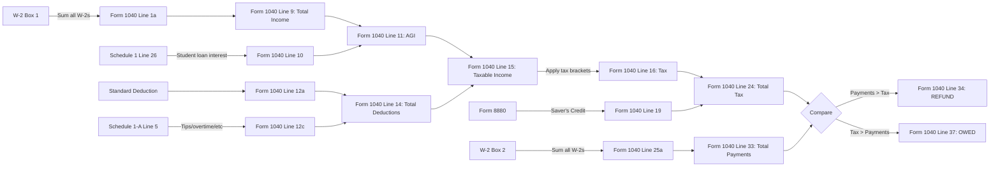

This guide shows you exactly how to transfer data from your W-2 and EZFile calculations to [Free File Fillable Forms](https://www.freefilefillableforms.com/).

## How Free File Fillable Forms Works

<Steps>
  <Step title="Create an account">
    Go to https://www.freefilefillableforms.com/
    
    **You'll need:**
    - Your Social Security Number
    - Date of birth
    - Prior year AGI (from 2024 tax return) OR prior year self-select PIN
  </Step>
  
  <Step title="Select your form">
    - Choose **Form 1040** (or **Form 1040-SR** if you're 65+)
    - The forms are functionally identical; 1040-SR just has larger print
  </Step>
  
  <Step title="Fill in fields">
    - Click on each field and type the value
    - Some fields auto-calculate (addition/subtraction)
    - Most fields require manual entry—this is where EZFile helps
  </Step>
  
  <Step title="Add schedules if needed">
    - Click "Add Form" to attach Schedule 1, Schedule 1-A, Form 8880, etc.
    - These flow automatically to Form 1040
  </Step>
  
  <Step title="Review and submit">
    - Check all entries carefully
    - E-sign the return
    - Submit electronically to the IRS
    - Save a PDF copy for your records
  </Step>
</Steps>

<Warning>
  **Important:** Free File Fillable Forms does very little math for you. You must calculate most values yourself and enter them. That's exactly what EZFile does—it provides the calculated values you need to enter.
</Warning>

---

## Form 1040: Field Mapping

### Top Section: Personal Information

| Field | What to Enter | Source |
|-------|---------------|--------|
| Your first name and middle initial | Your legal first name | W-2 Box e |
| Last name | Your legal last name | W-2 Box e |
| Your social security number | Your full SSN | W-2 Box a (you have the original) |
| Filing status | Check "Single" | Always Single for EZFile users |
| Digital assets question | Check "No" (unless you had crypto) | Ask user if uncertain |

<Note>
  Unlike EZFile, you WILL enter your full SSN on the actual tax form. EZFile masks it for privacy during calculation, but you need the real number to file.
</Note>

---

### Address Section

| Field | What to Enter | Source |
|-------|---------------|--------|
| Home address (number and street) | Your current mailing address | May differ from W-2 Box f |
| Apartment number | If applicable | -- |
| City, town, or post office | Current city | -- |
| State | Two-letter state code | -- |
| ZIP code | Five-digit ZIP code | -- |
| Foreign country name | Leave blank (if U.S. address) | -- |

---

### Income Section

<AccordionGroup>
  <Accordion title="Line 1a: Wages, salaries, tips">
    **What to enter:** Sum of all W-2 Box 1 amounts
    
    **Example:**
    ```
    W-2 #1 Box 1: $44,629
    W-2 #2 Box 1: $12,500
    
    Enter in Line 1a: $57,129
    ```
    
    **Source:** W-2 Box 1 (total taxable federal wages)
  </Accordion>
  
  <Accordion title="Line 1b through 1h: Other income types">
    **What to enter:** $0 for each (unless applicable)
    
    **These lines are for:**
    - 1b: Tax-exempt interest
    - 1c: Qualified dividends
    - 1d: IRA distributions
    - 1e: Pensions and annuities
    - 1f: Social Security benefits
    - 1g: Capital gains
    - 1h: Other income
    
    **For W-2-only filers:** All $0
  </Accordion>
  
  <Accordion title="Line 1z: Total wages">
    **What to enter:** Same as Line 1a
    
    **Calculation:** Line 1a + 1b + ... + 1h
    
    **For W-2-only filers:** Line 1z = Line 1a
  </Accordion>
  
  <Accordion title="Line 8: Other income from Schedule 1">
    **What to enter:** Amount from Schedule 1, Line 10 (if you filed Schedule 1)
    
    **Common sources:** Unemployment compensation, gambling winnings, jury duty pay
    
    **For most W-2 filers:** $0
  </Accordion>
  
  <Accordion title="Line 9: Total income">
    **What to enter:** Line 1z + Line 8
    
    **Example:**
    ```
    Line 1z: $57,129
    Line 8:  $0
    
    Enter in Line 9: $57,129
    ```
    
    This is your total income before adjustments.
  </Accordion>
</AccordionGroup>

---

### Adjustments to Income

| Line | Field Name | Value to Enter | Source |
|------|------------|----------------|--------|
| **10** | Adjustments to income | Amount from Schedule 1, Line 26 | Student loan interest deduction |
| **11** | Adjusted gross income (AGI) | Line 9 - Line 10 | **This is your AGI** |

<Tip>
  **Line 11 (AGI)** is critical—save this number. You'll need it to file next year's taxes.
</Tip>

**Example with student loan interest:**
```
Line 9 (Total income):       $57,129
Line 10 (Adjustments):       $2,500  (from Schedule 1)

Enter in Line 11 (AGI):      $54,629
```

---

### Standard Deduction

<Tabs>
  <Tab title="Under 65">
    **Line 12a: Standard deduction**
    
    Enter: **$15,750**
    
    Check the box: "You as a dependent" = NO
    
    (Check "Spouse itemizes" = NO)
  </Tab>
  
  <Tab title="65 or Older">
    **Line 12a: Standard deduction**
    
    Enter: **$17,750**
    
    Check the boxes:
    - "You as a dependent" = NO
    - "Age/Blindness" = Check "You were born before January 2, 1961"
    
    The $2,000 additional deduction is built into the $17,750.
  </Tab>
  
  <Tab title="Blind">
    **Line 12a: Standard deduction**
    
    Enter: **$17,750** (blind only) or **$19,750** (65+ and blind)
    
    Check the boxes:
    - "You as a dependent" = NO
    - "Age/Blindness" = Check applicable boxes
    
    Each additional circumstance adds $2,000.
  </Tab>
</Tabs>

---

### Deductions (Lines 12-14)

| Line | Field Name | Value to Enter | Source |
|------|------------|----------------|--------|
| **12b** | Charitable contributions | $0 | Only if itemizing (rare) |
| **12c** | Schedule 1-A total | Amount from Schedule 1-A, Line 5 | Tips, overtime, car loan, senior deduction |
| **13** | Qualified business income | $0 | W-2 filers have no QBI |
| **14** | Total deductions | 12a + 12b + 12c + 13 | Sum of all deduction lines |

**Example:**
```
Line 12a: $15,750  (standard deduction)
Line 12b: $0
Line 12c: $1,200   (from Schedule 1-A)
Line 13:  $0

Enter in Line 14: $16,950
```

---

### Taxable Income

<Card title="Line 15: Taxable Income" icon="calculator" color="#16a34a">
  **Formula:** Line 11 (AGI) - Line 14 (Total deductions)
  
  **Cannot be negative:** If the result is negative, enter $0
  
  **Example:**
  ```
  Line 11 (AGI):              $54,629
  Line 14 (Total deductions): $16,950
  
  Enter in Line 15:           $37,679
  ```
  
  **This is the number that determines your tax bracket.**
</Card>

---

### Tax Calculation (Line 16)

<Steps>
  <Step title="Find your bracket">
    Use your taxable income (Line 15) to find your tax bracket.
    
    **2025 Single Filer Brackets:**
    - 10%: $0 - $11,925
    - 12%: $11,926 - $48,475
    - 22%: $48,476 - $103,350
    - 24%: $103,351 - $197,300
    - 32%: $197,301 - $250,525
    - 35%: $250,526 - $626,350
    - 37%: Over $626,350
  </Step>
  
  <Step title="Calculate your tax">
    Use the appropriate formula from the table below.
    
    **Example (Taxable income: $37,679):**
    ```
    Bracket: 12% ($11,926 - $48,475)
    
    Tax = $1,192.50 + ($37,679 - $11,925) × 0.12
    Tax = $1,192.50 + $25,754 × 0.12
    Tax = $1,192.50 + $3,090.48
    Tax = $4,282.98
    
    Enter in Line 16: $4,283 (rounded)
    ```
  </Step>
</Steps>

**Tax Bracket Formulas:**

| If Line 15 is... | Tax Calculation |
|------------------|------------------|
| $0 - $11,925 | Line 15 × 0.10 |
| $11,926 - $48,475 | $1,192.50 + (Line 15 - $11,925) × 0.12 |
| $48,476 - $103,350 | $5,578.50 + (Line 15 - $48,475) × 0.22 |
| $103,351 - $197,300 | $17,651.00 + (Line 15 - $103,350) × 0.24 |
| $197,301 - $250,525 | $40,099.00 + (Line 15 - $197,300) × 0.32 |
| $250,526 - $626,350 | $57,131.00 + (Line 15 - $250,525) × 0.35 |
| Over $626,350 | $188,769.75 + (Line 15 - $626,350) × 0.37 |

---

### Tax and Credits (Lines 17-24)

| Line | Field Name | Value to Enter | Source |
|------|------------|----------------|--------|
| **17** | Amount from Schedule 2, line 21 | $0 | AMT or excess premium tax credit (rare) |
| **18** | Add lines 16 and 17 | Same as Line 16 | For W-2 filers, usually equals Line 16 |
| **19** | Nonrefundable credits | Amount from Schedule 3, Line 8 | Saver's Credit if eligible |
| **20** | Reserved | (Leave blank) | -- |
| **21** | Other credits from Schedule 3 | $0 | -- |
| **22** | Subtract Line 19 from Line 18 | Line 18 - Line 19 | Cannot go below $0 |
| **23** | Other taxes from Schedule 2 | $0 | No additional taxes for W-2 filers |
| **24** | **Total tax** | Line 22 + Line 23 | **This is your total federal tax liability** |

**Example with Saver's Credit:**
```
Line 16: $4,283
Line 17: $0
Line 18: $4,283
Line 19: $200  (Saver's Credit)
Line 22: $4,083
Line 23: $0

Enter in Line 24: $4,083
```

---

### Payments (Lines 25-33)

<AccordionGroup>
  <Accordion title="Line 25a: Federal tax withheld from W-2s">
    **What to enter:** Sum of all W-2 Box 2 amounts
    
    **Example:**
    ```
    W-2 #1 Box 2: $4,200
    W-2 #2 Box 2: $1,100
    
    Enter in Line 25a: $5,300
    ```
  </Accordion>
  
  <Accordion title="Line 25b: Federal tax withheld from 1099s">
    **What to enter:** $0 (unless you have 1099-INT, 1099-DIV, etc.)
    
    **For W-2-only filers:** $0
  </Accordion>
  
  <Accordion title="Line 25c: Other withholding">
    **What to enter:** $0 (unless you made estimated tax payments)
    
    **For W-2-only filers:** $0
  </Accordion>
  
  <Accordion title="Line 25d: Total federal tax withheld">
    **What to enter:** Line 25a + Line 25b + Line 25c
    
    **For W-2-only filers:** Same as Line 25a
    
    **Example:**
    ```
    Enter in Line 25d: $5,300
    ```
  </Accordion>
  
  <Accordion title="Line 26: Estimated tax payments">
    **What to enter:** $0 (unless you made quarterly payments)
    
    **For W-2-only filers:** $0
  </Accordion>
  
  <Accordion title="Line 27a: Earned Income Credit (EIC)">
    **Eligibility:** Single filers with AGI ≤ $19,104 (no children)
    
    **What to enter:** EIC amount from EIC table or Form 8812
    
    **Check the box:** "EIC" if claiming
    
    **For most filers:** $0 (unless very low income)
  </Accordion>
  
  <Accordion title="Lines 28-32: Other payments">
    **What to enter:** $0 for each (unless applicable)
    
    **These lines are for:**
    - 28: Additional child tax credit
    - 29: American opportunity credit
    - 30: Recovery rebate credit
    - 31: Amount from Schedule 3, line 15
    - 32: Other payments
    
    **For typical W-2 filers:** All $0
  </Accordion>
  
  <Accordion title="Line 33: Total payments">
    **What to enter:** Line 25d + Line 26 + Line 27a + Lines 28-32
    
    **For most W-2 filers:** Line 25d + Line 27a (if eligible)
    
    **Example:**
    ```
    Line 25d: $5,300
    Line 27a: $0
    
    Enter in Line 33: $5,300
    ```
  </Accordion>
</AccordionGroup>

---

## Refund or Amount Owed

<Tabs>
  <Tab title="Refund (Line 34)">
    **If Line 33 > Line 24:**
    
    **Refund = Line 33 - Line 24**
    
    **Example:**
    ```
    Line 33 (Total payments): $5,300
    Line 24 (Total tax):      $4,083
    
    Enter in Line 34: $1,217 (REFUND)
    ```
    
    ---
    
    ### Direct Deposit Information
    
    **Line 35a: Amount of Line 34 you want refunded to you**
    - Enter: Same as Line 34
    
    **Line 35b: Routing number**
    - Enter: Your bank's 9-digit routing number
    - Find it on a check (first 9 digits at bottom)
    
    **Line 35c: Type**
    - Check "Checking" or "Savings"
    
    **Line 35d: Account number**
    - Enter: Your bank account number
    - Find it on a check (after routing number)
    
    <Tip>
      Direct deposit refunds typically arrive in 10-21 days. Paper checks take 4-6 weeks.
    </Tip>
  </Tab>
  
  <Tab title="Amount Owed (Line 37)">
    **If Line 24 > Line 33:**
    
    **Amount owed = Line 24 - Line 33**
    
    **Example:**
    ```
    Line 24 (Total tax):      $4,500
    Line 33 (Total payments): $4,100
    
    Enter in Line 37: $400 (OWED)
    ```
    
    ---
    
    ### Payment Options
    
    <CardGroup cols={2}>
      <Card title="Pay Online" icon="credit-card">
        **IRS Direct Pay (free):**
        
        https://www.irs.gov/payments
        
        Pay directly from checking or savings
      </Card>
      
      <Card title="Pay by Check" icon="money-check">
        **Mail payment with Form 1040-V**
        
        Make check payable to "United States Treasury"
        
        Include SSN and "2025 Form 1040" on memo line
      </Card>
      
      <Card title="Payment Plan" icon="calendar-days">
        **If you can't pay in full:**
        
        Apply for an installment agreement at IRS.gov
        
        Setup fee: $31-$225 depending on plan
      </Card>
      
      <Card title="Credit/Debit Card" icon="credit-card">
        **Third-party processors:**
        
        Charge a convenience fee (~2%)
        
        Available at IRS.gov/payments
      </Card>
    </CardGroup>
    
    **Payment due date:** April 15, 2026
    
    ---
    
    ### Line 38: Estimated Tax Penalty
    
    **When it applies:** You owe more than $1,000 and didn't withhold enough during the year
    
    **Safe harbor rule:** If you withheld at least 90% of current year tax OR 100% of prior year tax, no penalty
    
    **For most W-2 filers:** $0 (withholding is usually sufficient)
    
    <Note>
      If you think you owe a penalty, use Form 2210 to calculate it. Free File Fillable Forms may calculate it automatically.
    </Note>
  </Tab>
</Tabs>

---

## Schedule 1: Additional Income and Adjustments

**When to add:** Student loan interest deduction, unemployment income, or other adjustments

<Steps>
  <Step title="Add Schedule 1 to your return">
    In Free File Fillable Forms:
    1. Click "Add Form" or "+" button
    2. Search for "Schedule 1"
    3. Select "Schedule 1 (Form 1040)"
  </Step>
  
  <Step title="Fill in Part II: Adjustments to Income">
    **Most common for W-2 filers:**
    
    | Line | Field | Value |
    |------|-------|-------|
    | 21 | Student loan interest deduction | Enter amount (max $2,500) |
    | 26 | Total adjustments | Sum of Part II lines |
    
    **Student loan interest phaseout:**
    - Full deduction: MAGI ≤ $85,000
    - Partial deduction: MAGI $85,001 - $99,999
    - No deduction: MAGI ≥ $100,000
  </Step>
  
  <Step title="Transfer to Form 1040">
    **Schedule 1, Line 26 → Form 1040, Line 10**
    
    This happens automatically in Free File Fillable Forms.
  </Step>
</Steps>

**Example:**
```
Schedule 1, Line 21: $2,500 (student loan interest)
Schedule 1, Line 26: $2,500 (total adjustments)

Form 1040, Line 10: $2,500
```

---

## Schedule 1-A: New Deductions (2025)

**When to add:** Tips, overtime pay, car loan interest, or senior deduction (65+)

<Steps>
  <Step title="Add Schedule 1-A to your return">
    In Free File Fillable Forms:
    1. Click "Add Form"
    2. Search for "Schedule 1-A"
    3. Select "Schedule 1-A (Form 1040)"
  </Step>
  
  <Step title="Fill in applicable lines">
    | Line | Field | Maximum | Phaseout |
    |------|-------|---------|----------|
    | 1 | Tip income deduction | Actual tips | $75K - $100K MAGI |
    | 2 | Overtime pay deduction | Actual overtime | $75K - $100K MAGI |
    | 3 | Auto loan interest | $10,000 | $75K - $100K MAGI |
    | 4 | Senior deduction | $4,000 (if 65+) | $75K - $100K MAGI |
    | 5 | Total | Sum of Lines 1-4 | -- |
    
    **Sources:**
    - Line 1: W-2 Box 7 (Social Security tips)
    - Line 2: Calculate from pay stubs (overtime hours × overtime rate)
    - Line 3: Auto loan interest statement (new car purchased in 2025)
    - Line 4: Flat $4,000 if you were 65+ on Dec 31, 2025
  </Step>
  
  <Step title="Transfer to Form 1040">
    **Schedule 1-A, Line 5 → Form 1040, Line 12c**
    
    This happens automatically in Free File Fillable Forms.
  </Step>
</Steps>

**Example with senior deduction:**
```
Schedule 1-A, Line 1: $0
Schedule 1-A, Line 2: $0
Schedule 1-A, Line 3: $0
Schedule 1-A, Line 4: $4,000 (senior deduction)
Schedule 1-A, Line 5: $4,000

Form 1040, Line 12c: $4,000
```

---

## Form 8880: Saver's Credit

**When to add:** AGI ≤ $39,500 AND you made retirement contributions (401k, 403b, 457, IRA)

<Steps>
  <Step title="Check eligibility">
    **All must be true:**
    - AGI ≤ $39,500 (single filer)
    - Age 18 or older
    - NOT a full-time student
    - NOT claimed as a dependent
    - Made retirement contributions during 2025
  </Step>
  
  <Step title="Add Form 8880 to your return">
    In Free File Fillable Forms:
    1. Click "Add Form"
    2. Search for "8880"
    3. Select "Form 8880 (Credit for Qualified Retirement Savings Contributions)"
  </Step>
  
  <Step title="Fill in Form 8880">
    | Line | Field | Value |
    |------|-------|-------|
    | 1 | Traditional and Roth IRA contributions | Enter amount from W-2 Box 12 (codes D, E, G, AA, BB) |
    | 2 | Maximum contribution | $2,000 |
    | 3 | Smaller of Line 1 or Line 2 | min(Line 1, $2,000) |
    | 4 | Credit rate | 50%, 20%, or 10% based on AGI |
    | 5 | Credit amount | Line 3 × Line 4 |
    
    **Credit rates (Single filer):**
    - 50%: AGI ≤ $23,750
    - 20%: AGI $23,751 - $25,850
    - 10%: AGI $25,851 - $39,500
  </Step>
  
  <Step title="Transfer to Schedule 3 and Form 1040">
    **Form 8880, Line 5 → Schedule 3, Line 4 → Form 1040, Line 19**
    
    This flows automatically in Free File Fillable Forms.
  </Step>
</Steps>

**Example:**
```
AGI: $30,000
401(k) contributions (W-2 Box 12 Code D): $3,000

Form 8880:
Line 1: $3,000
Line 2: $2,000 (maximum)
Line 3: $2,000 (smaller of Lines 1 and 2)
Line 4: 10% (credit rate for AGI $30,000)
Line 5: $200 (credit amount)

Form 1040, Line 19: $200
```

---

## Signature Section

| Field | What to Enter |
|-------|---------------|
| Your signature | E-sign with Free File Fillable Forms |
| Date | Date you file |
| Your occupation | Your job title (e.g., "Teacher", "Nurse", "Engineer") |
| Identity Protection PIN (IP PIN) | If you received one from IRS (6-digit number) |
| Phone number | Your best contact number |
| Email address | Your email address |

<Note>
  **IP PIN:** Only enter if the IRS sent you one. Most taxpayers don't have one. It's used for identity theft protection.
</Note>

---

## After Submission

<Steps>
  <Step title="Get confirmation">
    Free File Fillable Forms will provide a confirmation number after successful submission.
    
    **Save this number** and the PDF copy of your return.
  </Step>
  
  <Step title="Track your refund">
    Check refund status at:
    
    **IRS "Where's My Refund?" tool:**
    https://www.irs.gov/refunds
    
    Available 24 hours after e-filing
    
    **You'll need:**
    - SSN
    - Filing status (Single)
    - Exact refund amount
  </Step>
  
  <Step title="Refund timeline">
    **E-filed with direct deposit:** 10-21 days (typical)
    
    **E-filed with paper check:** 4-6 weeks
    
    **Paper filed:** 6-8 weeks
  </Step>
  
  <Step title="Save records">
    **Keep for at least 3 years:**
    - Copy of filed Form 1040
    - All W-2s
    - Form 1098-E (student loan interest)
    - Confirmation number
    
    **Keep for 7 years if:**
    - You claimed a loss from worthless securities
    - You filed a claim for credit or refund after filing
  </Step>
</Steps>

---

## Troubleshooting

<AccordionGroup>
  <Accordion title="Error: SSN doesn't match IRS records">
    **Cause:** Name or SSN entered incorrectly
    
    **Solution:**
    - Verify SSN matches Social Security card exactly
    - Verify name matches Social Security card (including hyphens, spaces)
    - If you changed your name, update with Social Security Administration first
  </Accordion>
  
  <Accordion title="Error: Prior year AGI doesn't match">
    **Cause:** Prior year AGI entered incorrectly
    
    **Solution:**
    - Check 2024 tax return, Line 11
    - If you didn't file in 2024, enter $0
    - Use self-select PIN option if you can't find prior year AGI
  </Accordion>
  
  <Accordion title="Rejected: Dependent claim on another return">
    **Cause:** Someone else claimed you as a dependent
    
    **Solution:**
    - Verify you cannot be claimed as a dependent
    - If you CAN be claimed, you must check the "You as a dependent" box
    - If you CANNOT be claimed but someone did, file by paper and include explanation
  </Accordion>
  
  <Accordion title="Math doesn't match EZFile calculation">
    **Cause:** Formula error or data entry mistake
    
    **Solution:**
    - Double-check all W-2 Box 1 and Box 2 entries
    - Verify taxable income calculation (AGI - deductions)
    - Recalculate tax using bracket formulas
    - Use EZFile `/calculate` command to verify
  </Accordion>
  
  <Accordion title="Can't find Schedule 1-A">
    **Cause:** Schedule 1-A is new for 2025; may not be available early in filing season
    
    **Solution:**
    - Wait until IRS releases final forms (usually mid-January)
    - Check Free File Fillable Forms "Add Form" search
    - If not available, file without it and amend later if necessary
  </Accordion>
</AccordionGroup>

---

## Quick Reference: Data Flow



<Tip>
  **Use this flow to verify your entries.** Every number on Form 1040 should trace back to a W-2 box, a schedule, or a calculation.
</Tip>
